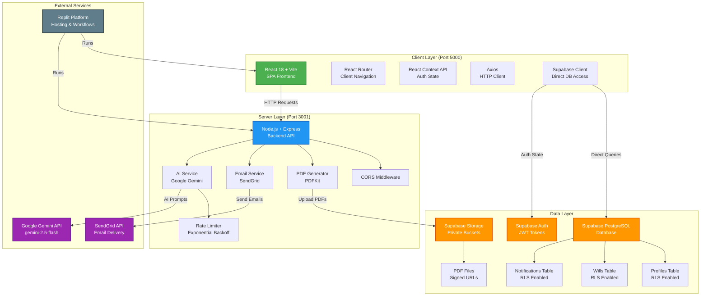
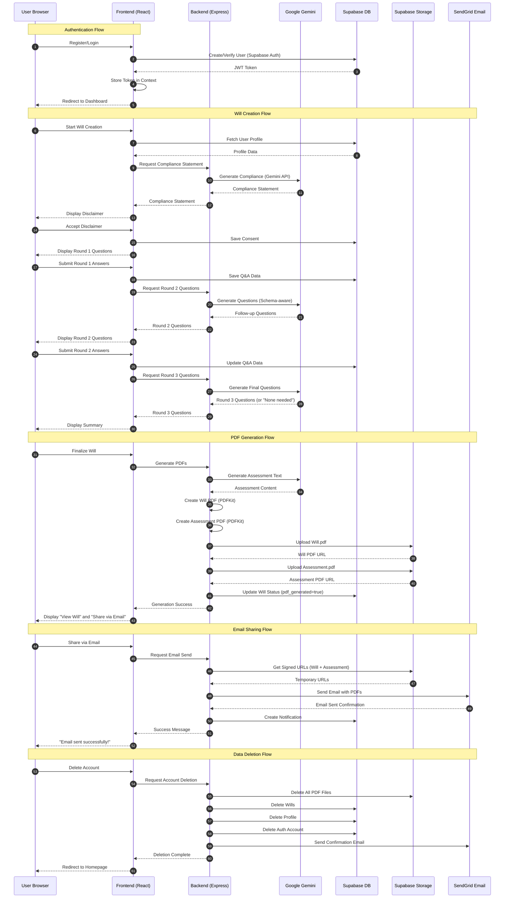
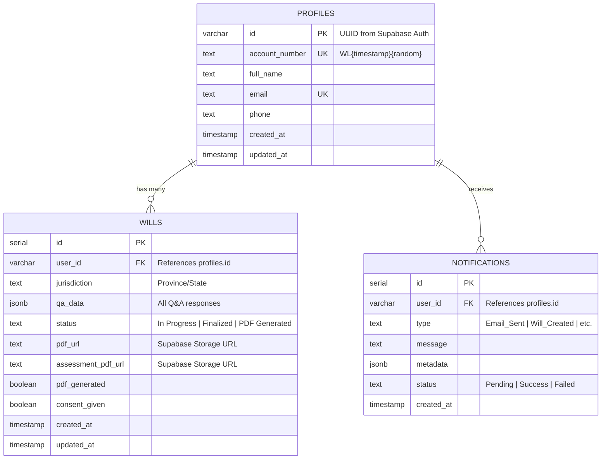
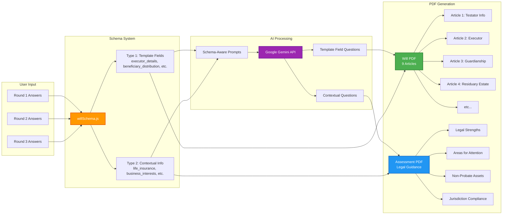
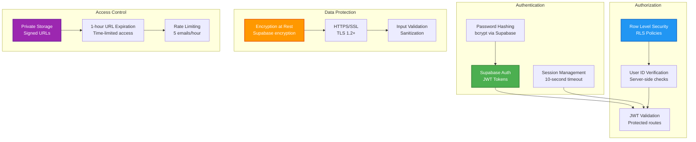

# System Architecture Diagram

**Legal Will Generation Tool** - Full-Stack Web Application  
**Last Updated:** November 23, 2025

---

## High-Level Architecture



---

## Component Interaction Flow



---

## Database Schema



---

## Data Flow: Schema-Driven Architecture



---

## Technology Stack Summary

| Layer | Technology | Purpose |
|-------|-----------|---------|
| **Frontend** | React 18 | Component-based UI |
| | Vite | Build tool and dev server |
| | React Router | Client-side routing |
| | Axios | HTTP client for API requests |
| | React Context API | Global auth state management |
| **Backend** | Node.js 20 | JavaScript runtime |
| | Express.js | Web framework |
| | PDFKit | PDF document generation |
| | CORS | Cross-origin resource sharing |
| **Database** | Supabase PostgreSQL | Relational database |
| | Row Level Security (RLS) | Data access control |
| | Supabase Auth | JWT-based authentication |
| | Supabase Storage | Private file storage |
| **AI/ML** | Google Gemini API | AI question generation |
| | gemini-2.5-flash model | Fast, cost-effective model |
| | Rate Limiter | Exponential backoff |
| **Email** | SendGrid | Transactional email service |
| **Hosting** | Replit | Cloud platform |
| | Dual Workflows | Frontend (5000) + Backend (3001) |
| **Version Control** | Git + GitHub | Source control |

---

## Security Architecture



---

## File Structure

```
Legal-Will-Generation-Tool/
├── public/                    # Static assets
│   ├── Brand_Kit.html        # Global styling reference
│   └── favicon.svg
├── src/                       # Frontend source
│   ├── components/           # React components
│   │   ├── Header.jsx
│   │   ├── Footer.jsx
│   │   └── ProtectedRoute.jsx
│   ├── pages/                # Page components
│   │   ├── Home.jsx
│   │   ├── Login.jsx
│   │   ├── Register.jsx
│   │   ├── Dashboard.jsx
│   │   ├── Questionnaire.jsx
│   │   ├── WillSummary.jsx
│   │   └── PrivacyPolicy.jsx
│   ├── context/              # React Context
│   │   └── AuthContext.jsx
│   ├── App.jsx               # Main app component
│   └── main.jsx              # Entry point
├── server/                    # Backend source
│   ├── index.js              # Express server
│   ├── lib/                  # Core libraries
│   │   ├── gemini.js         # AI integration
│   │   ├── pdfGenerator.js   # PDF creation
│   │   ├── willSchema.js     # Schema definitions
│   │   └── supabase.js       # Supabase client
│   └── migrations/           # Database migrations
│       └── 001_create_profiles_table.sql
├── database/                  # Database documentation
│   └── migrations/
├── Old PRDs/                  # Historical documents
├── ARCHITECTURE.md            # This file
├── PRD_final.md              # Final PRD
├── PROMPT_LOG.md             # Development log
├── README.md                 # Project overview
├── TESTING_GUIDE.md          # Testing instructions
├── Privacy_Policy.md         # Privacy notice
├── package.json              # Frontend dependencies
└── server/package.json       # Backend dependencies
```

---

## Deployment Configuration

### Replit Workflows

**Frontend Workflow:**
```bash
Command: npm run dev
Port: 5000 (exposed to internet)
Output: webview
Description: Vite dev server with HMR
```

**Backend Workflow:**
```bash
Command: cd server && node index.js
Port: 3001 (internal)
Output: console
Description: Express API server
```

### Environment Variables

**Shared Environment (Development & Production):**
- `VITE_SUPABASE_URL` → Frontend Supabase connection
- `VITE_SUPABASE_ANON_KEY` → Frontend public API key

**Secrets (Encrypted):**
- `SUPABASE_SERVICE_ROLE_KEY` → Backend admin operations
- `GOOGLE_GENERATIVE_AI_API_KEY` → Gemini API access
- `SENDGRID_API_KEY` → Email delivery

---

## Key Architectural Decisions

### 1. Schema-Driven AI System
**Decision:** Separate template fields from contextual information  
**Rationale:** AI needed guidance on what goes IN the will vs what informs the assessment  
**Impact:** Single source of truth for data flow, easier maintenance, clearer AI alignment

### 2. Dual Database Access Pattern
**Decision:** Frontend uses Supabase Client directly, Backend uses Admin SDK  
**Rationale:** Leverage RLS for security, admin SDK for privileged operations (file upload, auth deletion)  
**Impact:** Reduced backend API surface area, better security model

### 3. Email-Only PDF Delivery
**Decision:** No direct download buttons, email sharing only  
**Rationale:** Security (audit trail), simplicity (no client-side file handling)  
**Impact:** Rate limiting required, better tracking of document distribution

### 4. Three-Round Questionnaire Limit
**Decision:** Maximum 3 rounds of AI questions  
**Rationale:** Prevent infinite loops, balance completeness with user experience  
**Impact:** AI must be efficient, users complete process in reasonable time

### 5. Notification Backend Without UI
**Decision:** Build notifications table and backend but disable UI  
**Rationale:** Future-proofing, time constraints prioritized core features  
**Impact:** System scalable for future notification panel

---

## Performance Considerations

### Frontend Optimization
- Vite's fast HMR for development
- React.lazy() for code splitting (if needed in future)
- Axios interceptors for centralized error handling
- Context API for minimal re-renders

### Backend Optimization
- Rate limiting with exponential backoff (Google Gemini)
- Timeout handling (10 seconds for auth token retrieval)
- CORS pre-flight caching
- PDF generation on-demand (not pre-generated)

### Database Optimization
- Indexes on frequently queried columns (user_id, account_number)
- RLS policies with efficient WHERE clauses
- JSONB for flexible Q&A storage
- Auto-update triggers for timestamps

---

## Scalability Path (Future)

### Horizontal Scaling
- Stateless backend allows multiple instances
- Supabase handles database scaling
- SendGrid handles email throughput
- Replit autoscaling for traffic spikes

### Feature Expansion
- Mobile apps (React Native) using same backend API
- Notification UI activation (backend ready)
- AI chatbot integration (infrastructure exists)
- Global jurisdictions (schema extensible)
- Document versioning (database schema supports)

---

**Last Updated:** November 23, 2025  
**Status:** Production architecture documented and deployed
